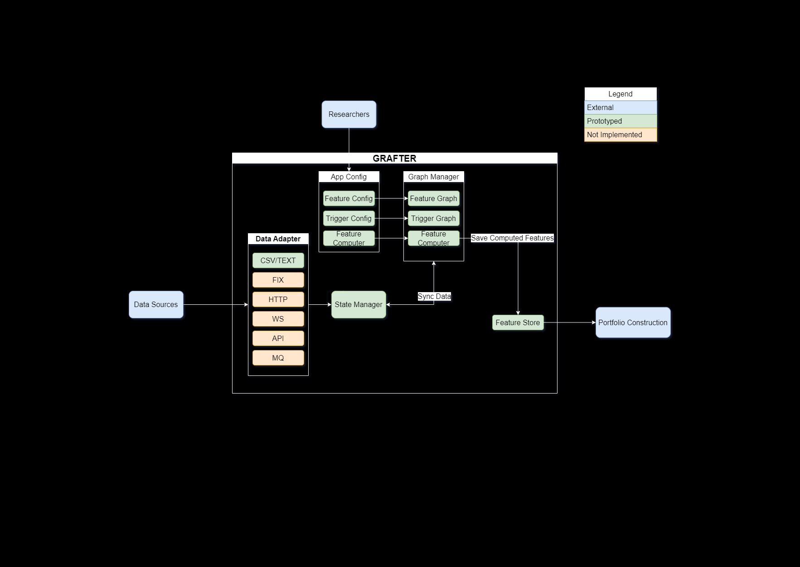

<div align="center">
  <h1> GRAFTER
  <br>(<font color="red">GR</font>aph-based fr<font color="red">A</font>mework for <font color="red">F</font>eature calcula<font color="red">T</font>ion and <font color="red">E</font>vent t<font color="red">R</font>iggers)
</h1>
  <a href="https://www.python.org/downloads/" target="_blank">
    
  </a>
</div>
<br>

This project is a toy example of a graph-based framework for feature calculation and event triggers. It demonstrates how to use networkx to manage dependencies between features and event triggers. The project is designed to be extensible and can be used as a starting point for building more complex systems.

## Table of Contents

- [Architecture Overview](#architecture-overview)
- [Design Overview](#design-overview)
  - [Design Document](#design-document)
  - [Graph Structures and Interactions](#graph-structures-and-interactions)
  - [Implementation Details](#implementation-details)
  - [Assumptions](#assumptions)
- [Installation](#installation)
- [Usage](#usage)
- [Configuration](#configuration)
- [Features](#features)
- [Event Triggers](#event-triggers)
- [Feature Store](#feature-store)
- [Testing](#testing)
- [Development](#development)

## Architecture Overview



## Design Overview

### Design Document

### Graph Structures and Interactions

Our project utilizes two primary graph structures: FeatureGraph and EventTriggerGraph. These graphs are implemented using the networkx library and are designed to manage the dependencies and execution flow of features and event triggers, respectively.

#### FeatureGraph

- The FeatureGraph manages the dependencies between different features. Each node in the graph represents a feature, and edges represent dependencies between these features.
- The graph is constructed in the `GraphManager._build_feature_graph` method, where each feature and its dependencies are added as nodes and edges.
- The feature computation logic is encapsulated in the `FeatureComputer` class, and each feature node in the graph is associated with a corresponding compute function.

#### EventTriggerGraph

- The EventTriggerGraph manages the event triggers and their dependencies. Each node represents an event trigger, and edges represent dependencies between these triggers.
- The graph is constructed in the `GraphManager._build_event_trigger_graph` method, where each event trigger and its dependencies are added as nodes and edges.
- The event trigger evaluation logic is implemented in the `EventTriggerGraph` class, which includes methods for evaluating conditions and checking time-based triggers.

### Implementation Details

#### Event Triggers

- Event triggers are defined in the configuration file and can be of type time or condition.
- The `EventTriggerGraph` class provides methods to add event triggers (`add_event_trigger`), evaluate conditions (`evaluate_condition`), and check time-based triggers (`check_time_trigger`).
- The `GraphManager.is_triggered` method checks if any event triggers are activated based on the current state.

#### Feature Calculations

- Features are defined in the configuration file with their respective dependencies.
- The `FeatureGraph` class manages the feature nodes and their dependencies.
- The `GraphManager.compute_features` method computes the features based on the current state by traversing the `FeatureGraph` and invoking the appropriate compute functions from the `FeatureComputer` class.

### Assumptions

#### Configuration Format

- The configuration is provided in a YAML file, and it is assumed that the structure of this file adheres to the expected format as defined in the `AppConfig` class.

#### Feature and Event Trigger Definitions

- It is assumed that all features and event triggers defined in the configuration have corresponding compute functions and evaluation logic implemented in the `FeatureComputer` and `EventTriggerGraph` classes, respectively.

#### State Management

- The state required for evaluating conditions and computing features is managed by the `StateManager` class. It is assumed that the state is correctly retrieved and updated as needed.

#### Feature Store

- The feature store configuration supports different types of storage, such as lmdb and in_memory. It is assumed that the feature store is correctly initialized and used to save and retrieve feature data.

## Installation

To install the required dependencies, run:

### Using `uv`

```sh
# create a virtual environment
uv venv --python 3.12.0

# activate the virtual environment
source .venv/bin/activate

# install the package
uv pip install .
```

### Using `pip`

```sh
# create a virtual environment
python -m venv .venv

# activate the virtual environment
source .venv/bin/activate

# install the package
pip install .
```

Other pip-compatible package managers, e.g., conda, mamba, pixi, can be used to install the package.

## Usage

To run the GRAFTER example, execute the following commands:

```sh
cd examples/csvloader
python data_generater.py
python run.py
```

The example demonstrates how to use GRAFTER as a library to calculate features based on trigger events. Final features are printed to the terminal and stored in `examples/csvloader/tmp/feature_store`.

## Configuration

The configuration is defined in a YAML file (`config.yaml`). Below is an example configuration:

```yaml
data_source:
  type: csv
  path: sample_data.csv

features:
  moving_average: [market_price]
  price_momentum: [market_price, moving_average]
  sentiment_momentum: [sentiment_score]
  headline_sentiment: [headline]
  text_sentiment: [text_body]
  headline_sentiment_spread: [sentiment_score, headline_sentiment]
  text_sentiment_spread: [text_sentiment, headline_sentiment]

event_triggers:
  daily_1300:
   type: time
   trigger_time: ["13:00"]
   dependencies: [price, news_update]
  price:
   type: condition
   condition: "state['price'] > 1"
  news_update:
   type: condition
   condition: "state['has_new_news']"

feature_store:
  type: lmdb
  config:
   path: /tmp/feature_store
```

## Features

Features are defined in the `features` section of the configuration. Each feature has a list of dependencies that it relies on for computation.

The feature computer contains the logic to calculate the feature based on the dependencies. The feature computer is a function that takes the state and dependencies as input and returns the computed feature.

## Event Triggers

Event triggers are defined in the `event_triggers` section of the configuration. Each event trigger can be of type time or condition and has a list of dependencies.

## Feature Store

The feature store configuration is defined in the `feature_store` section. It supports different types of storage, such as lmdb and in_memory.

## Testing

Install pytest:

```sh
# uv
uv pip install pytest pytest-asyncio pytest-cov

# pip
pip install pytest pytest-asyncio pytest-cov
```

To run the tests:

```sh
pytest
```

To run the tests and check the coverage, use the following command:

```sh
pytest --cov=grafter --cov-report=html tests/
```

This will generate an HTML coverage report in the `htmlcov` directory.

## Development

Pre-commit hooks are used to ensure code quality. To install pre-commit, run:

```sh
# uv
uv pip install pre-commit

# pip
pip install pre-commit
```

To install the pre-commit hooks, run:

```sh
pre-commit install
```
